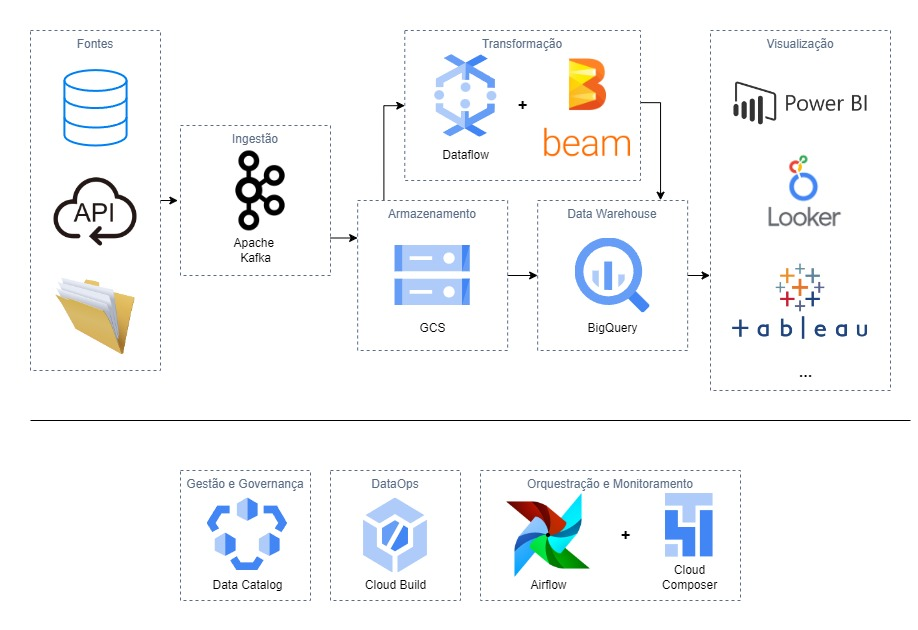

### Carlos Reis
### Case técnico para o Grupo SBF - Arquiteto de Dados
# Arquitetura de Plataforma de Dados: Empresa XYZ 

Este documento apresenta uma proposta para a arquitetura de uma plataforma de dados autônoma, pensada para atender aos requisitos específicos e desafios da empresa XYZ. As tecnologias e ferramentas sugeridas foram selecionadas com base em sua eficácia, escalabilidade e adaptabilidade, garantindo uma solução duradoura que pode evoluir de acordo com as demandas de negócio. Para isso, foi utilizado um misto da minha experiência pessoal com referências literárias, principalmente da obra `“Fundamentals of Data Engineering”`, de Joe Reis e Matt Housley, distribuído pela `O'Reilly`. 

Neste cenário, me propus a desenvolver uma solução de Data Lakehouse baseada na cloud da Google (`GCP`). Algumas ferramentas externas e de código aberto, como o `Apache Kafka`, `Beam` e `Airflow`, complementarão a arquitetura para não engessar as escolhas, pois são componentes facilmente desacopláveis da plataforma. A GCP foi escolhida como plataforma de cloud, pois é a que melhor se integra nativamente às tecnologias citadas. A seguir, uma explicação sobre as escolhas de tecnologias e seus papéis na arquitetura proposta. 

#### Diagrama da arquitetura final

## Ingestão

Dado o contexto do desafio, é necessária uma ferramenta que possibilite consumir dados rapidamente, pois há relatórios que precisam ser entregues em 2 minutos ou menos. O `Apache Kafka` é uma plataforma de streaming de dados que fornece a possibilidade de customizar conectores e ter uma ingestão contínua de maneira rápida e segura. O Kafka oferece uma boa integração com diferentes componentes da arquitetura, já que pode se conectar diretamente com as camadas de armazenamento, transformação e com o BigQuery. O caso de uso dessas integrações diretas dependem das definições técnicas de montagem dos pipelines, mas é importante ter diferentes opções. 

#### Outras possibilidades

Para a utilização do Kafka na GCP, a melhor forma de uso seria através do `Confluent Cloud`, que oferece uma versão escalável no ambiente de cloud. Dentro da GCP, existe uma ferramenta de mensageria com funcionalidades parecidas, o `Pub/Sub`, que, apesar de nativa, não tem a mesma flexibilidade na criação de conectores e também não oferece features importantes como persistência em disco, replicação e partições de mensagens, como temos no Kafka. Outra razão para a não utilização do Pub/Sub é a intenção de ter flexibilidade quanto a plataforma de cloud; caso um dia haja razão para uma migração de plataforma, quanto menos ferramentas dependentes dela, melhor.

## Armazenamento

Os dados ingeridos pelo Kafka podem ter vários consumidores, um deles será integrado ao `Google Cloud Storage (GCS)`, uma plataforma de armazenamento de objetos que servirá como nosso principal backup de dados no formato em que eles são entregues pela fonte, uma das bases da arquitetura de `Lakehouse`. As vantagens do `GCS` incluem preço de armazenamento, classificação dinâmica de dados, tolerância a falhas e segurança. \
A classificação dinâmica é especialmente importante na escolha de um object storage, pois temos a opção de classificar um dado como `Standard`, `Nearline`, `Coldline` e `Archive`, definido pela frequência de acesso aos dados, tendo uma diferente precificação para cada.

## Processamento

Após ter uma maneira segura, rápida e consistente de ingerir e manter os dados na nuvem, é necessária uma ferramenta para fazer transformações, sejam elas simples como limpeza e validação ou complexas como aplicação de regras de negócio e agregações. Levando em consideração que este se trata de um pipeline que precisa lidar com `batch` e `streaming` de dados, escolhi o `Dataflow` como principal plataforma de processamento. O Dataflow é implementado no modelo Beam, que oferece uma maneira unificada de processar dados das duas maneiras, diferenciando a janela de tempo trabalhada nos jobs, o que facilita o desenvolvimento e ajuda na manutenção e monitoramento dos pipelines.

### Orquestração e monitoramento de jobs

O Airflow é uma das principais tecnologias de orquestração e monitoramento da atualidade, é bem estabelecida na orquestração de pipelines em batch e traz a possibilidade de criar componentes customizados para testes, alertas e monitoramento tanto dos nossos pipelines em batch quanto em streaming. Na GCP, o Airflow pode ser escalado utilizando o `Cloud Composer`, uma solução que cria componentes de infra de maneira nativa, tirando a preocupação em manter um cluster dedicado.

## Data Warehouse

Em uma implementação de Lakehouse, esta é a espinha dorsal que une a escalabilidade e flexibilidade de um `Data Lake` com a confiabilidade, desempenho e usabilidade de um `Data Warehouse`, fornecendo uma plataforma unificada para armazenamento, processamento, análise e visualização de dados. Hoje, uma das tecnologias mais utilizadas para este fim é o BigQuery, uma plataforma completa e robusta, nativa da GCP, facilmente integrável aos componentes que já temos na arquitetura e a outros que ainda podem surgir, compatível inclusive com outras plataformas de cloud, como a AWS.

## Visualização

Os dados estruturados e semiestruturados e catalogados no BigQuery podem ser conectados nativamente a uma vasta gama plataformas de visualização, que, como descrito nos requisitos, serão utilizadas mais uma, o que não seria problema nesta arquitetura.

## Governança e DataOps

A GCP tem duas soluções nativas para estas operações: `Data Catalog`, que se integra facilmente ao Bigquery, cataloga e organiza os dados, e `Cloud Build`, que facilita a implementação de um pipeline robusto com poucos cliques, poupando tempo de implementação de outras ferramentas como `Jenkins`.

## Considerações futuras

Um possível futuro para esta arquitetura seria parametrizá-la e modularizá-la em domínios, para mais controle de segurança e governança ao longo dos diferentes departamentos organizacionais. Por exemplo, um time de marketing teria seus próprios pipelines dedicados às suas campanhas e que nada dependeriam de uma estrutura central comum a todos. 

## Visão geral e conclusão

`Data Lakehouse` é uma solução robusta e moderna para situações comuns a muitas empresas em desenvolvimento, como a deste desafio. O conceito se propõe a evoluir e unir os conceitos de `Data Lake` e `Data Warehouse` em uma arquiterura mais sucinta, organizada e flexível. \
Nesta implementação, há margem para criatividade nos casos de uso, como por exemplo:
* Visualização de dados em tempo real: \
Uma das fontes pode se conectar ao Kafka, enviando os dados gerados em tempo real em formato de fila, que então poderiam ser enviadas paralelamente a diferentes grupos de consumidores, como o Cloud Storage, que armazenaria os dados, o Dataflow, pode aplicar quaisquer operações necessárias antes de enviar ao BigQuery, ou diretamente ao BigQuery, caso não haja necessidade de processamento. Com isso, a conexão com as ferramentas de visualização farão com que os dados possam ser analisados em tempo real.

* Geração de relatórios por tempo: \
Os dados que foram ingeridos de maneira contínua permanecem armazenados no nosso ambiente, sejam eles completamente estruturados ou apenas arquivos semiestruturados, com isso, há possibilidade de agregar os dados por tempo, seja semana, mensal, anual ou o completo histórico dos dados ao longo dos anos. Para isso, pode-se usar o Dataflow ou, dependendo do caso, consultas diretas no BigQuery.

* Disponibilizar os dados para pipelines de ML/IA: \
A partir deste ponto, é possível ampliar a arquitetura para englobar projetos de Machine Learning, que leem grandes quantidades de dados, pois com a utilização do BigQuery, temos uma velocidade alta e precificação razoável para leitura.

Em suma, esta arquitetura permite uma vasta gama de operações, com poucos componentes imutáveis e muita abertura para testes e novas integrações.